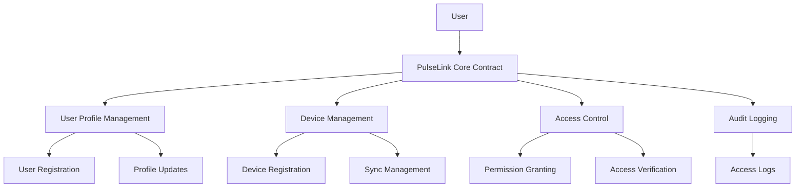

# PulseLink Health Aggregator

A decentralized health data aggregation platform built on Stacks blockchain that enables secure management and sharing of health metrics from wearable devices.

## Overview

PulseLink empowers users to:
- Collect and consolidate health data from multiple wearable devices
- Maintain complete control over their health information
- Share data securely with healthcare providers, researchers, and fitness coaches
- Track all data access through an immutable audit trail

The platform prioritizes user data sovereignty while providing robust permissioning capabilities for selective data sharing.

## Architecture



The PulseLink platform is built around a central smart contract that manages:
- User profiles and authentication
- Device registration and synchronization
- Granular data access permissions
- Comprehensive audit logging

All health data is stored off-chain in encrypted format, with the blockchain managing access control and maintaining access records.

## Contract Documentation

### PulseLink Core Contract

The core contract (`pulselink-core.clar`) implements the following key functionalities:

#### User Management
- User registration and profile management
- Profile deactivation capabilities
- Email and name updates

#### Device Management
- Device registration and linking
- Sync time tracking
- Device deactivation

#### Access Control
- Granular permission management
- Time-based access control
- Multiple access types (read, write, read-write)
- Support for various data categories

#### Audit Logging
- Immutable access logs
- Purpose tracking for each access
- Comprehensive audit trail

## Getting Started

### Prerequisites
- Clarinet
- Stacks wallet
- Node.js environment

### Installation

1. Clone the repository
2. Install dependencies:
```bash
clarinet install
```

3. Deploy contracts:
```bash
clarinet deploy
```

## Function Reference

### User Management

```clarity
(register-user (name (string-utf8 100)) (email (string-utf8 100)))
(update-user-profile (name (string-utf8 100)) (email (string-utf8 100)))
(deactivate-user)
```

### Device Management

```clarity
(register-device (device-id (string-utf8 50)) (device-name (string-utf8 100)) (device-type (string-utf8 50)))
(update-device-sync (device-id (string-utf8 50)))
(deactivate-device (device-id (string-utf8 50)))
```

### Access Control

```clarity
(grant-access (accessor principal) (data-category uint) (access-type uint) (expires-at uint))
(revoke-access (accessor principal) (data-category uint))
(request-data-access (owner principal) (data-category uint) (purpose (string-utf8 200)))
```

## Development

### Testing

Run the test suite:
```bash
clarinet test
```

### Local Development

1. Start local Clarinet console:
```bash
clarinet console
```

2. Deploy contracts:
```bash
(contract-call? .pulselink-core ...)
```

## Security Considerations

### Data Privacy
- Health data is stored off-chain and encrypted
- Only access control metadata is stored on-chain
- Users maintain complete control over their data

### Access Control
- Time-bound permissions
- Granular data category control
- Revocable access rights
- Audit trail for all access attempts

### Limitations
- Contract cannot enforce off-chain data access
- Users must trust third-party storage solutions
- Access revocation doesn't affect already accessed data

### Best Practices
- Regularly review access permissions
- Set appropriate expiration times for access grants
- Monitor access logs for unauthorized attempts
- Implement proper key management for off-chain data encryption